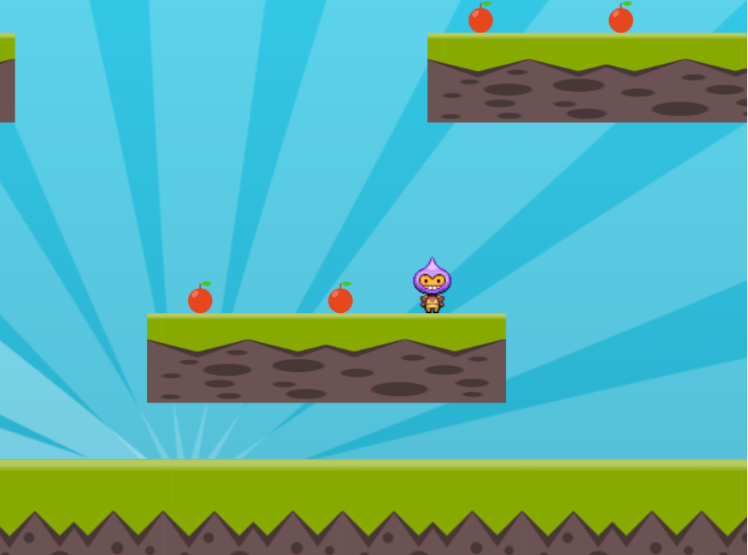

### Preview:

 In this game we implemented <b>arrays</b> ds.  
To build this game we used the <b>'Phaser'</b> Framework.  
<b>Logics</b> and <b>Concepts</b> implemented in this game: 

<ul>
  <li> Physics Concepts</li>
  <ol>
    <li>Jump</li>
    <li>Bounce</li>
    <li>Gravity</li>
    <li>Speed</li>
  </ol>
  <li> How to use Keyboard for activity</li>
  <li> Animations </li>
  <li> Tweens(For moving sunrays effect in background using Arrays ds) </li>
  <li> Camera Control</li>
  <li> Dynamic and Static group logic</li>
  <li> Collision and Overlap logic</li>
</ul>
    
###### This is how the game looks.
   
