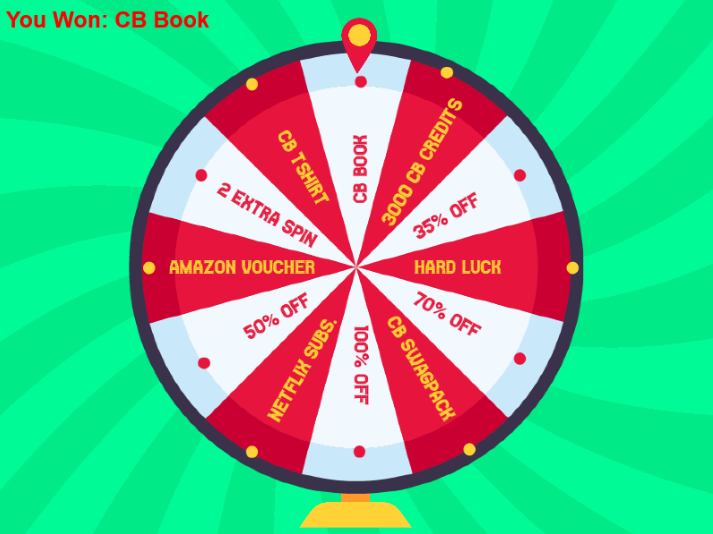

### Preview:

 In this game we implemented <b>arrays</b> ds and used some mathematical concepts.   
To build this game we used the <b>'Phaser'</b> Framework.  
<b>Logics</b> and <b>Concepts</b> implemented in this game: 

<ul>
  <li> GameLoop in Phaser</li>
  <li> Adding Images</li>
  <li> Animations </li>
  <li> Arrays </li>
  <li> Mathematical concepts</li>
  <li> Adding Music</li>
  <li> OOPs </li>
</ul>

<b>Here are some improvements to the game that we build as a part of the assignment.<b>

Disable Spin

1) Disable Spin, if the wheel is already in spinning state. The current version doesn't check if the wheel is in spinning state or not. User should be able get the next spin only when the first spin is stopped. Implement this feature in the code.

Add Tap to Spin Button

2) Instead of Mouse Click, add a button "Tap to Spin" which triggers the spin_wheel function. Refer this example - https://phaser.io/examples/v2/buttons/action-on-click

Add Music

3) Play background music when the wheel is spinning. Refer examples here - http://phaser.io/examples/v3/category/audio/html5-audio

Add New Feature

4) Add any 1 new feature of your choice to make the game more engaging and attractive.

###### This is how the game looks.

   
